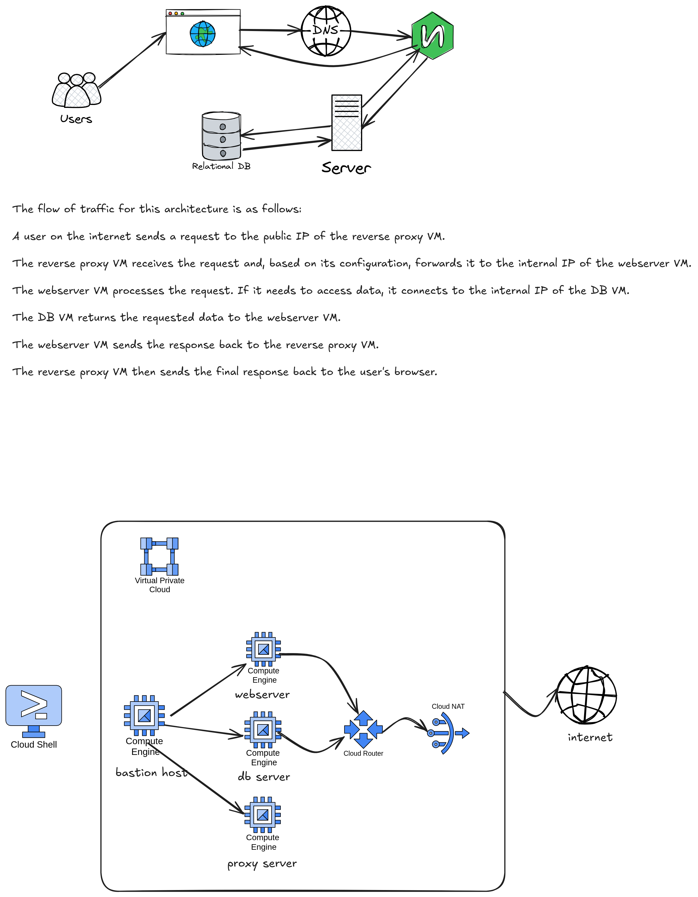

### Instructions on installing SSL cert on nginx
nginx runs on a proxy server and you will install and configure SSL cert

```
sudo yum install epel-release
sudo yum install certbot python3-certbot-nginx
```
```
sudo certbot --nginx -d example.com -d www.example.com
```
_edit with your actual domain name you registered_

>Certbot modifies your NGINX configuration to listen on port 443 (HTTPS) and serve your domain securely. However, you'll need to manually adjust the configuration to act as a reverse proxy.
>The file is typically located in /etc/nginx/conf.d/ or /etc/nginx/sites-enabled/. Find the server block for your domain. It should look something like this after Certbot has run:
```
server {
    listen 443 ssl;
    server_name example.com www.example.com;

    ssl_certificate /etc/letsencrypt/live/example.com/fullchain.pem;
    ssl_certificate_key /etc/letsencrypt/live/example.com/privkey.pem;
    include /etc/letsencrypt/options-ssl-nginx.conf;
    ssl_dhparam /etc/letsencrypt/ssl-dhparams.pem;

    # The following block is what you need to add for the reverse proxy
    location / {
        proxy_pass http://localhost:8080; # Replace with the actual address and port of your application
        proxy_set_header Host $host;
        proxy_set_header X-Real-IP $remote_addr;
        proxy_set_header X-Forwarded-For $proxy_add_x_forwarded_for;
        proxy_set_header X-Forwarded-Proto $scheme;
    }
}

# Optional: Redirect HTTP to HTTPS
server {
    listen 80;
    server_name example.com www.example.com;
    return 301 https://$host$request_uri;
}
```

```
sudo nginx -t
sudo systemctl reload nginx
```
